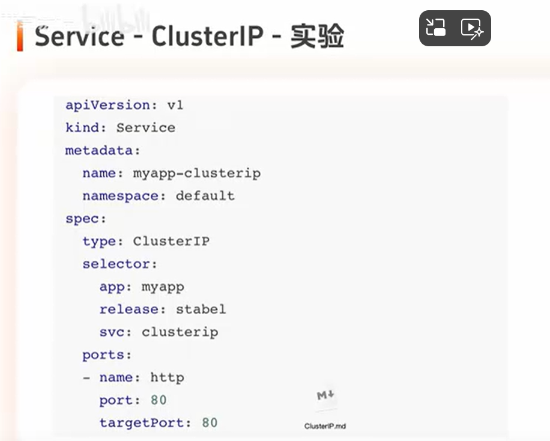
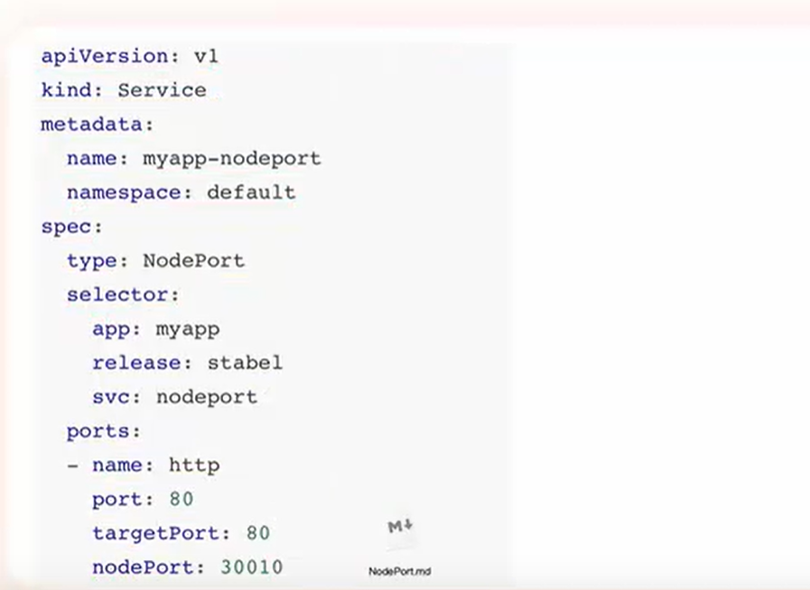
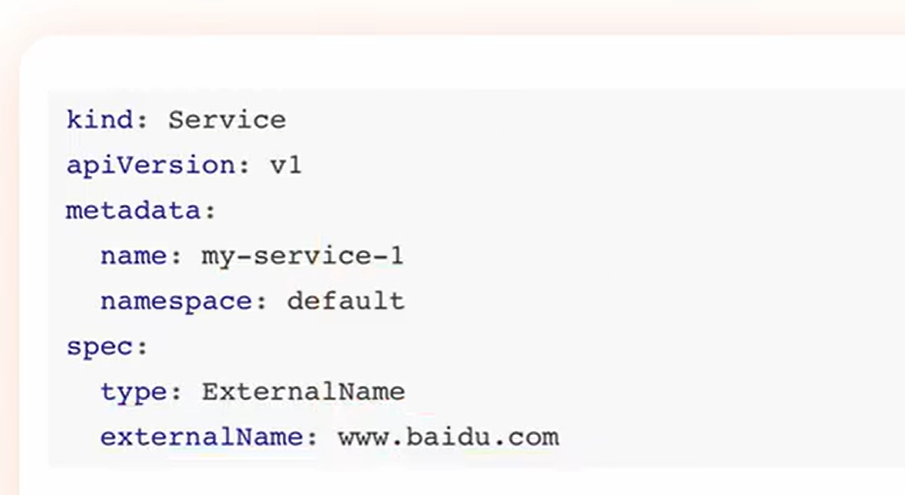
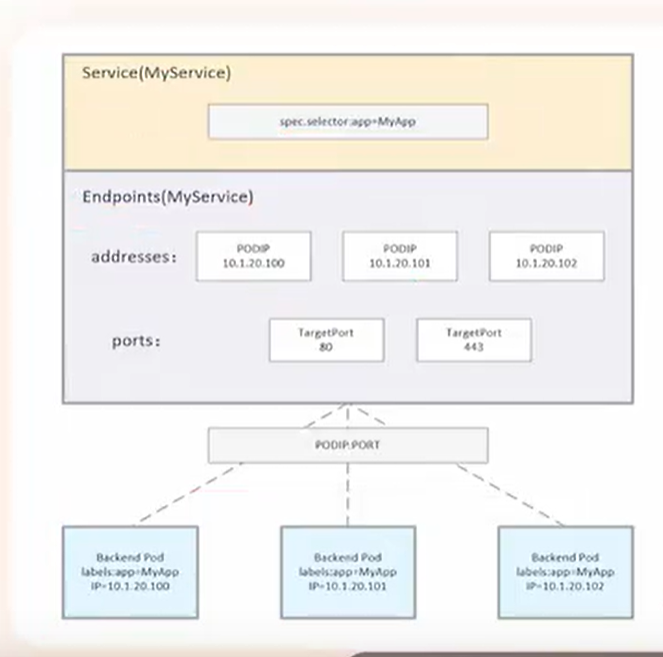

# Service的概念和原理

```
Service定义了一种抽象：一个Pod的逻辑分组，一种可以访问他们的策略--通常成为微服务
```

## Service的负载均衡方式

### Service--userspace

```
每个节点上会运行一个kube-proxy进程，kube-proxy监听apiServer，将Service变化修改本地的iptables规则
代理来自当前节点，或者其它节点的pod的用户请求
```


### Service--Iptables

```
kube-proxy监听apiServer，将监听结果写入本机的防火墙iptables规则

客户端的访问由防火墙转发到对应的pod上
```


### Service--Ipvs

```
kube-proxy监听apiServer，将监听结果写入本机的ipvs规则

客户端的访问由ipvs转发到对应的pod上
```

userspace被淘汰，默认使用iptables模式，ipvs性能比iptables更好，但是由于机器没有开启ipvs(即LVS)模块会导致k8s这个Service通信方式无法使用，官方担心你的机器没有开启，所以默认使用Iptables


## 简单命令

```shell
修改配置文件可以通过edit修改etcd中的资源
] kubectl edit deploy deploy-demo 
会进入编辑器界面，直接修改，保存退出。如果有错误保存退出不了

根据标签筛选
] kubectl get pod -l app=ddddd
] kubectl get pod --selector app=ddddd
#-l和--selector是通过标签选择器过滤要显示的pod
```


## Service--修改kube-proxy的负载均衡方式

```shell
] kubectl edit configmap kube-proxy -n kube-system
搜索模式/mode，该字段默认为空即iptables模式，现在修改成ipvs
mode: "ipvs"

手动更新pod，先删除对应的pod，再重建对应的pod
] kubectl delete pod -n kube-system -l k8s-app=kube-proxy
删完后k8s集群会自动重建

#重建后，查看ipvs规则，
] ipvsadm -Ln
每个svc对应一个集群，访问svc相当于访问ipvs集群
```


# Service的工作原理和使用

## Service类型

注：每个svc被创建后，k8s内部的DNS插件比如CoreDNS会给他分配一个默认域名,格式：svc的name.svc的命名空间.svc.当前集群的域名(默认cluster.local)。例子一个default命名空间的叫db的svc的默认域名：db.default.svc.cluster.local

```shell
ClusterIp：默认类型，自动分配一个仅Cluster内部可以访问的虚拟IP
NodePort：再ClusterIp的基础上，给Service的每台机器绑定一个端口，这样可以通过<NodeIP>:NodePort访问该服务
LoadBalancer：再NodePort的基础上，借助cloud provider创建一个外部负载均衡器，将请求转发到<NodeIP>:NodePort
ExternalName：把集群外部的服务引入到集群内部来，再集群内部直接使用。没有任何类型代理被创建。只有在k8s1.7及以上版本的kube-dns才支持
```


## Service的组件协同


### Service各类型实验

#### Service - ClusterIP

##### 例子



```shell
ports定义了负载均衡的端口，名字叫http，port集群端口80，targetPort后端真实服务器的端口80。

从这里可以看出kube-proxy的ipvs模式是ipvs的NAT模式，因为ipvs的集群端口和后端服务器端口可以不一致

] ipvsadm -Ln
#查看创建的svc集群

#安装伯克利大学DNS工具，里面有一个dig命令
] yun install -y bind-utils

#查看集群内的DNS插件的pod,会发现dns插件的pod
] kubectl get pod -n kube-system -o wide | grep dns

#查看dns插件的ip，会发现dns的pod会有TCP和UDP两个集群，且有一个svc给这些pod作负载均衡
] ipvsadm -Ln

#用一个svc的默认域名dig一下
] dig -t A myapp-clusterip.default.svc.cluster.local. @10.0.0.10

#验证dns解析是否正确
] kubectl get svc
```

##### Service - internalTrafficPolicy

```shell
仅适用于集群内部的流量
] kubectl explain svc.spec.internalTrafficPolicy
这个字段有两种类型Cluster和Local，默认Cluster类型。
Cluster：当一个pod访问svc时，不论这个svc在那个节点上，都可以访问
Local：当一个pod访问svc时，只有在这个pod同一个节点上的svc可以访问到，访问其它节点上svc会被防火墙drop掉
```

##### Service - externalTrafficPolicy

```
仅适用于集群外部的流量
这个字段同样有两种类型Cluster和Local
Cluster：可以转发到任意集群的pod上
Local：仅转发到当前节点的Pod上
```

##### Service-publishNotReadyAddresses

```
再pod的模板下
spec.publishNotReadyAddresses: true
开启这个选项，即使pod未就绪，只要标签匹配，pod就会被加入到负载均衡集群中
```


##### Service-会话保持(IPVS持久化链接)

```shell
service.spec.sessionAffinity: ClientIP	(默认值是None，即不打开)。这样在规定的超时时间内访问会被定向到同一个pod上
] ipvsadm -Ln
#可以看到添加持久化连接的svc集群有一个persistent的标志

] kubectl explain svc.spec.sessionAffinityConfig.clientIP
#默认是10800s(即3小时),可以通过timeoutSeconds设定超时时间 >0 && <=86400(1 day)
```


#### Service - NodePort

##### 例子



```shell
spec.ports列表指定由svc集群入口port: 80, 转发到的pod的端口targetPort: 80, 绑定的物理网卡端口nodePort: 30010，这个nodePort不指定就会自动分配

创建后对应的svc可以使用clusterIP类型的所有功能。

同时还有通过绑定的物理网卡的端口暴露svc给集群外部访问的功能

#在每个节点运行
] ipvsadm -Ln 
#可以看到在ipvs中给每块物理网卡的IP:nodePort做了负载均衡到 哪个svc对应的几个pod上，不走svc
#如果一个节点由多块网卡，ipvs会给每个网卡都做一个负载均衡集群
```

###### svc集群


###### 物理网卡集群


#### Service - LoadBalancer

```bash
service的定义和控制器触发：
1.用户创建或修改一个svc对象，并设置spec.type.LoadBalancer
2.运行在控制平面的Cloud Controller Manager(CCM)在持续监听svc资源的创建，会监听到该LoadBalancer类型的svc的创建

外部负载均衡器的创建：
1.当CCM监听到对应的svc被闯进啊后，会调用底层云平台的API：
2.自动创建一个L4(网络层)或L7(应用层)的外部负载均衡器
分配外部IP地址或DNS名称给这个负载均衡器
3.更新svc的状态，CCM将外部IP地址或DNS名称写回到对应svc的status.loadBalancer.ingress字段

流量路由配置：
LoadBalancer Service的流量路由通常是基于NodePort机制实现的：
1.自动分配NodePort：当创建LB svc时，会自动启用NodePort Service的功能。在集群的每一个节点上分配一个静态端口
2.负载均衡器配置目标：CCM配置外部负载均衡器，监听对应端口，将接受的流量转发到所有工作节点上的NodePort上
3.节点内转发：外部流量到达集群节点上的NodeIP:NodePort，节点上运行的kube-porxy将流量从NodePort进一步转发到svc的ClusterIP，最后流量从ClusterIP负载均衡到后端健康的Pod上


注意：
1.只要svc存在，外部的负载均衡器和IP就会保持不变
2.externalTrafficPolicy：Cluster默认，流量会在节点之间再次负载均衡，可以发送到任意节点上的Pod
Local流量只会发送到本地节点上的Pod，如果节点上没有后端Pod，该节点会健康检查失败，负载均衡器将不会向其发送流量
3.裸机：在没有云提供商的本地集群中，不能直接使用LoadBalancer，需要使用MetalLB等第三方项目来模拟云负载均衡器的行为
```

##### EKS两种模式

```
1. Instance 模式 (传统 NodePort 模式)
这是 Kubernetes 在云平台上的经典实现方式
工作原理：
（1）Service 创建后，AWS Cloud Controller Manager 或 AWS Load Balancer Controller 会在 AWS 中创建 Network Load Balancer (NLB) 或 Classic Load Balancer (CLB)。该 AWS 负载均衡器被配置为将流量发送到集群中的所有 Worker 节点。
（2）负载均衡器的目标组 (Target Group) 注册的是节点的 IP 地址和 Service 自动分配的 NodePort（例如 NodeIP:30001）。
（3）流量到达节点后，由该节点上的 kube−proxy (iptables/ipvs) 规则将流量从 NodePort 转发到 Service 的 ClusterIP，最终路由到后端 Pod。

2. IP 模式 (直连 Pod 模式)
利用了 AWS Load Balancer Controller 和 AWS CNI（容器网络接口）的集成能力。
工作原理：
(1)需要安装 AWS Load Balancer Controller，并在 Service 中添加特定注解
(2)AWS Load Balancer Controller 在 AWS 中创建 Network Load Balancer (NLB)。关键在于：负载均衡器的目标组 (Target Group) 直接注册 后端 Pod 的 IP 地址，而不是节点的 IP 和 NodePort。NLB 直接将流量路由到 Pod IP，完全跳过了 NodePort 和 kube−proxy 的转发步骤。
```


##### 例子


```yaml
annotations是和第三方开发者的约定，而不是官方
service.beta.kubernetes.io/alibaba-cloud-loadbalancer-id: LB的id
xxxxx: ‘true’ #表示接受协议

底层也是通过一些负载均衡技术实现的，比如ipvs等
```


#### Service - ExternalName

##### 例子



```
externalName是Service的特例，它没有Selector，也没有定义任何端口和Endpoint。相反，对于集群外部的服务，它可以通过返回该服务的别名这种方式来提供服务。

核心机制：在集群 DNS 中添加一条 CNAME 记录，将 Service 的域名指向配置的 externalName 域名。

当集群内部的pod访问这个externalName类型的service的域名my-service-1.default.svc.cluster.local.
会由这个svc做代理去访问这个svc的externalName的域名www.baidu.com，再将结果返回给pod。
这样就把集群外部的服务暴露给集群内布访问。
```


# Service - EndPoints

## EndPoints与Service和Pod之间的关联

### 例子



```
一个Service的目标Pod集合是由Label Selector来决定的

EndPoints是一组实际服务的端点集合。
一个Endpoint是一个可被访问的服务端点，即一个状态为running的pod的可访问端点。
这样一组可访问的pod组合起来，即这样一组Endpoint组合起来成为EndPoints。
只有被Service Selector匹配选中并且状态为Running的才会被加入到和Service同名的EndPoints中。

如果svc配置了selector -> 自动关联体系
svc创建后，会自动创建一个同名的endpoints，svc通过标签选择器会根据标签匹配符合需求的pod，并将对应的pod的访问地址动态(IP:port)地维护到endpoints中，kubelet只需要将这个endpoints维护到当前所在节点的ipvs规则中

如果svc没有配置selector -> 手动关联体系
svc创建后，不会自动创建同名的endpoints对象，需要管理员手动创建endpoints对象,再endpoints的配置文件中指定要关联的pod的访问地址
```

